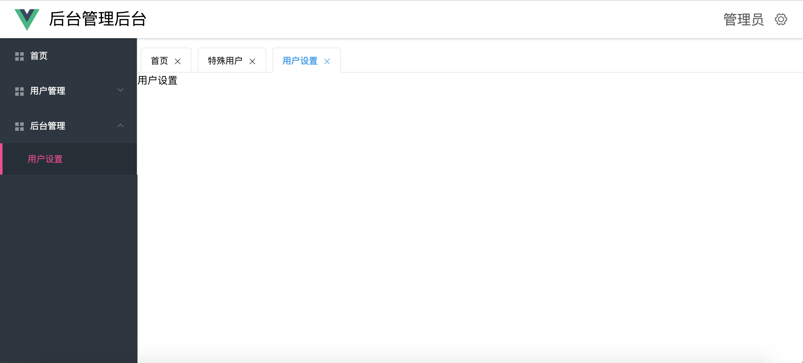
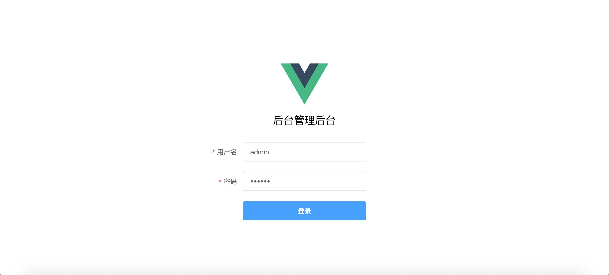
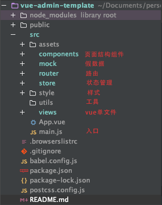

# 后台管理系统模板

### 简介
[vue-admin-template](https://github.com/lawliet467/vue-admin-template) 是一个简单的后台管理系统模板，它基于[vue](https://cn.vuejs.org/) 和 [element-ui](http://element-cn.eleme.io/#/zh-CN)。没有掺杂任何业务代码，开箱即用。  
项目由[vue-cli 3.0](https://cli.vuejs.org/zh/)创建，对于之前用2版本的小伙伴可以看看[这篇文章](https://www.jianshu.com/p/25987d0d4c4e)了解新特性与差异  
菜单用的是模拟数据，正常业务应该是读取接口的，对应格式可自行修改。  
有疑问可以直接联系我 QQ:532744984 也可以交个朋友交流
### 项目截图







### 开发

```
# 克隆项目
git clone https://github.com/lawliet467/vue-admin-template.git

# 安装依赖
npm install

# 建议不要用 cnpm 安装 会有各种诡异的bug 可以通过如下操作解决 npm 下载速度慢的问题
npm install --registry=https://registry.npm.taobao.org

# 启动服务
npm run serve
```

### 发布

```
# 构建生产环境
npm run build
```

### License
[MIT](https://github.com/lawliet467/vue-admin-template/License)  

Copyright (c) 2019-present lawliet467
